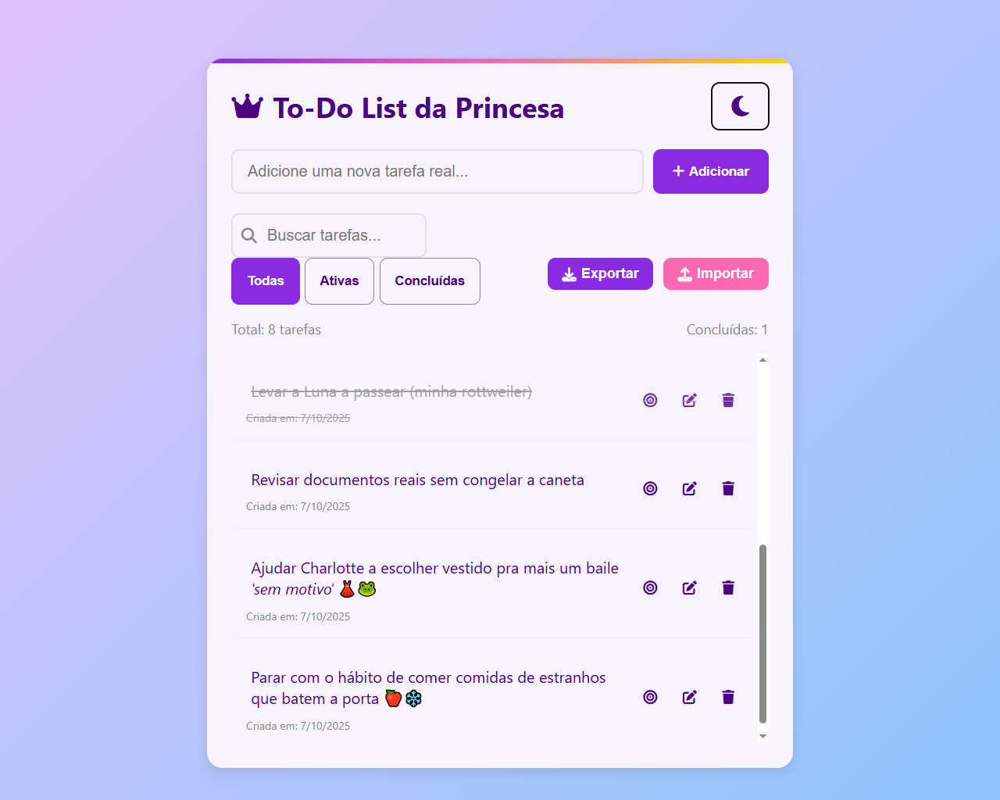
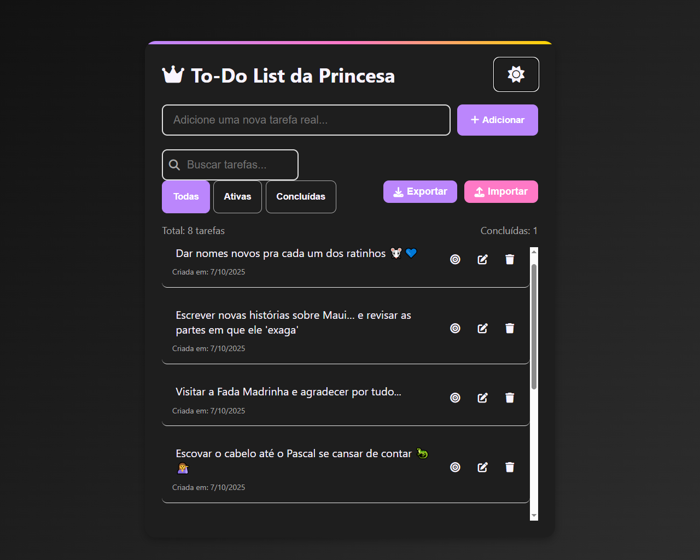

# 👑 To-Do List da Princesa

Uma aplicação web moderna e elegante para gerenciamento de tarefas com tema real, desenvolvida com HTML, CSS e JavaScript puro.


## 📋 Índice

- [✨ Características](#-características)
- [🚀 Demonstração](#-demonstração)
- [🛠️ Instalação e Uso](#️-instalação-e-uso)
- [🎯 Funcionalidades](#-funcionalidades)
- [🏗️ Estrutura do Projeto](#️-estrutura-do-projeto)
- [🎨 Personalização](#-personalização)
- [📱 Responsividade](#-responsividade)
- [🔧 Desenvolvimento](#-desenvolvimento)
- [🤝 Contribuindo](#-contribuindo)
- [📄 Licença](#-licença)
- [👥 Autores](#-autores)

## ✨ Características

**To-Do List da Princesa** é mais do que um simples gerenciador de tarefas - é um exemplo de profissionalismo e produtividade com:

- 🎭 **Tema Encantador**: Design inspirado em contos de fadas com elementos reais
- 🌙 **Modo Escuro/Claro**: Alternância suave entre temas
- 📱 **Design Responsivo**: Funciona perfeitamente em todos os dispositivos
- 💾 **Persistência de Dados**: Salva automaticamente no navegador
- 🎵 **Feedback Interativo**: Animações e efeitos visuais
- ♿ **Acessibilidade**: Totalmente navegável por teclado e leitores de tela

## 🚀 Demonstração

### Visualização Online
[🔗 Veja Tocando Me](https://jeeloa.github.io/trash_1)

### Capturas de Tela

| Modo Claro | Modo Escuro |
|------------|-------------|
|  |  |

## 🛠️ Instalação e Uso

### Pré-requisitos
- Navegador web moderno (Chrome 90+, Firefox 88+, Safari 14+)
- Servidor web local (opcional, para desenvolvimento)

### Instalação Local

1. **Clone o repositório**
```bash
git clone https://github.com/seu-usuario/to-do-list-princesa.git
cd to-do-list-princesa
```

2. **Execute em um servidor local**
```bash
# Com Python 3
python -m http.server 2005

# Com Node.js
npx http-server

# Com PHP
php -S localhost:2005
```

3. **Acesse no navegador**
```
http://localhost:2005
```

### Uso Imediato
```html
<!-- Se não for para desenvolver, basta abrir o arquivo HTML no navegador -->
<!-- Ou hospedar em qualquer serviço de static hosting -->
```

## 🎯 Funcionalidades Detalhadas

### ✨ Gerenciamento Básico de Tarefas
- **Adicionar Tarefas**: Campo de entrada com validação
- **Marcar como Concluída**: Clique único para alternar status
- **Excluir Tarefas**: Com confirmação para evitar erros
- **Edição Direta**: Clique no texto para editar inline

### 🔍 Sistema de Filtros e Busca
```javascript
// Filtros disponíveis
- Todas: Exibe todas as tarefas
- Ativas: Apenas tarefas não concluídas  
- Concluídas: Apenas tarefas finalizadas
- Busca: Filtro por texto em tempo real
```

### 🎮 Funcionalidades Avançadas

#### Drag & Drop
- **Reorganização Intuitiva**: Arraste e solte para reordenar
- **Feedback Visual**: Elementos destacados durante arraste
- **Persistência**: Ordem salva automaticamente

#### Modo Foco
```javascript
// Características do Modo Foco
- Tela cheia imersiva
- Fundo escurecido com blur
- Apenas uma tarefa visível
- Ações específicas no modo foco
```

#### Exportação/Importação
- **Formato JSON**: Estrutura padronizada
- **Backup Completo**: Inclui datas e status
- **Portabilidade**: Fácil migração entre dispositivos

### 🎨 Sistema de Temas
```css
/* Variáveis CSS para customização */
:root {
  --primary: #8a2be2;      /* Roxo real */
  --secondary: #ff69b4;    /* Rosa princesa */
  --accent: #ffd700;       /* Dourado real */
  --light: #f8f4ff;        /* Fundo claro */
  --dark: #4b0082;         /* Texto escuro */
}
```

### 📊 Estatísticas e Analytics
- Contador de tarefas totais
- Progresso de conclusão
- Metadados de criação
- Filtros aplicados

## 🏗️ Estrutura do Projeto

```
to-do-list-princesa/
│
├── index.html                 # Arquivo principal
├── README.md                  # Documentação
├── assets/                    # Recursos estáticos
│   ├── css/
│   │   └── style.css         # Estilos (embed no HTML)
│   ├── js/
│   │   └── app.js            # JavaScript (embed no HTML)
│   └── images/               # Imagens e ícones
│       ├── favicon.ico
│       └── preview.png
│
└── docs/                     # Documentação adicional
    ├── api.md
    └── deployment.md
```

### Arquitetura Técnica

```html
<!-- Estrutura HTML Principal -->
<div class="container">
  ├── Header (Título + Toggle Tema)
  ├── Input Group (Nova Tarefa)
  ├── Controls (Filtros + Export/Import)
  ├── Stats (Contadores)
  ├── Task List (Lista de Tarefas)
  └── Empty State (Estado Vazio)
</div>
```

## 🎨 Personalização

### Cores do Tema
```css
/* Para personalizar as cores, modifique as variáveis CSS */
:root {
  --primary: #seu-roxo;
  --secondary: #seu-rosa; 
  --accent: #seu-dourado;
  /* ... outras variáveis */
}
```

### Adicionando Novos Ícones
```html
<!-- Use Font Awesome ou ícones personalizados -->
<i class="fas fa-icone-personalizado"></i>
```

### Customizando Animações
```css
/* Modifique as keyframes para animações personalizadas */
@keyframes fadeIn {
  from { opacity: 0; transform: translateY(-10px); }
  to { opacity: 1; transform: translateY(0); }
}
```

## 📱 Responsividade

A aplicação é totalmente responsiva com breakpoints estratégicos:

- **Desktop**: > 1024px (Layout completo)
- **Tablet**: 768px - 1024px (Layout adaptado)  
- **Mobile**: < 768px (Layout otimizado para touch)

### Mobile-First Features
- Botões com tamanho adequado para touch
- Gestos de arraste otimizados
- Navegação por swipe (futuro)
- Interface simplificada em telas pequenas

## 🔧 Desenvolvimento

### Tecnologias Utilizadas
- **HTML5**: Estrutura semântica
- **CSS3**: Grid, Flexbox, Variáveis CSS, Animações
- **JavaScript ES6+**: Modules, LocalStorage, Drag & Drop API
- **Font Awesome 6**: Ícones vetoriais

### Estrutura de Código

#### JavaScript Modules
```javascript
// Gerenciamento de Estado
const state = {
  tasks: [],
  filter: 'all',
  theme: 'light'
};

// Funções Principais
export function addTask(text) { /* ... */ }
export function toggleTask(id) { /* ... */ }
export function deleteTask(id) { /* ... */ }
```

#### Sistema de Eventos
```javascript
// Event Delegation para performance
document.getElementById('taskList').addEventListener('click', (e) => {
  if (e.target.classList.contains('delete-btn')) {
    deleteTask(e.target.dataset.id);
  }
});
```

### Performance Optimizations
- **Debounced Search**: Busca com delay para performance
- **Event Delegation**: Menos listeners de evento
- **CSS Containment**: Melhor render performance
- **Lazy Loading**: Carregamento sob demanda (futuro)

## 🧪 Testes

### Testes Manuais
```bash
# Checklist de testes
- [ ] Adicionar nova tarefa
- [ ] Marcar/desmarcar como concluída  
- [ ] Excluir tarefa com confirmação
- [ ] Filtrar por status
- [ ] Buscar tarefas
- [ ] Arrastar e soltar
- [ ] Alternar tema
- [ ] Exportar/importar dados
- [ ] Responsividade
```

### Compatibilidade de Navegadores

| Navegador | Versão | Status |
|-----------|---------|---------|
| Chrome | 90+ | ✅ Completamente compatível |
| Firefox | 88+ | ✅ Completamente compatível |
| Safari | 14+ | ✅ Completamente compatível |
| Edge | 90+ | ✅ Completamente compatível |

## 🤝 Contribuindo

Contribuições são bem-vindas! Siga estas etapas:

1. **Fork o projeto**
2. **Crie uma branch para sua feature**
```bash
git checkout -b feature/IncrivelHelp
```
3. **Commit suas mudanças** 
```bash
git commit -m 'Adiciona um Incrivel Contributo'
```
4. **Push para a branch**
```bash
git push origin feature/IncrivelHelp
```
5. **Abra um Pull Request**

### Guidelines de Código
- Siga o estilo de código existente
- Adicione comentários para código complexo
- Atualize a documentação quando necessário
- Teste em múltiplos navegadores

## 📄 Licença

Distribuído sob licença MIT. Veja [`LICENSE`](license) para mais informações.

## 👥 Autores

- **Jerusa Eloá** - *Desenvolvimento Total* - [Jeeloa](https://github.com/jeeloa)

### Agradecimentos

- Ícones por [Font Awesome](https://fontawesome.com)
- Inspiração de design por [Beny Reis](https://instagram.com/bkapa8)
- Titio [Gustavo Guanabara](https://www.youtube.com/c/Cursoemvideo)

## 🔮 Roadmap Futuro

- [ ] **Sincronização em Nuvem**
- [ ] **App Mobile (PWA)**
- [ ] **Colaboração em Tempo Real**
- [ ] **Templates de Listas**
- [ ] **Lembretes e Notificações**
- [ ] **Análises e Relatórios**
- [ ] **Integração com Calendário**

---

<div align="center">

**Feito com 💜 e um toque de magia real**

*Que suas tarefas sejam tão organizadas quanto um castelo encantado!*

[⬆ Voltar ao topo](#-to-do-list-da-princesa)

</div>